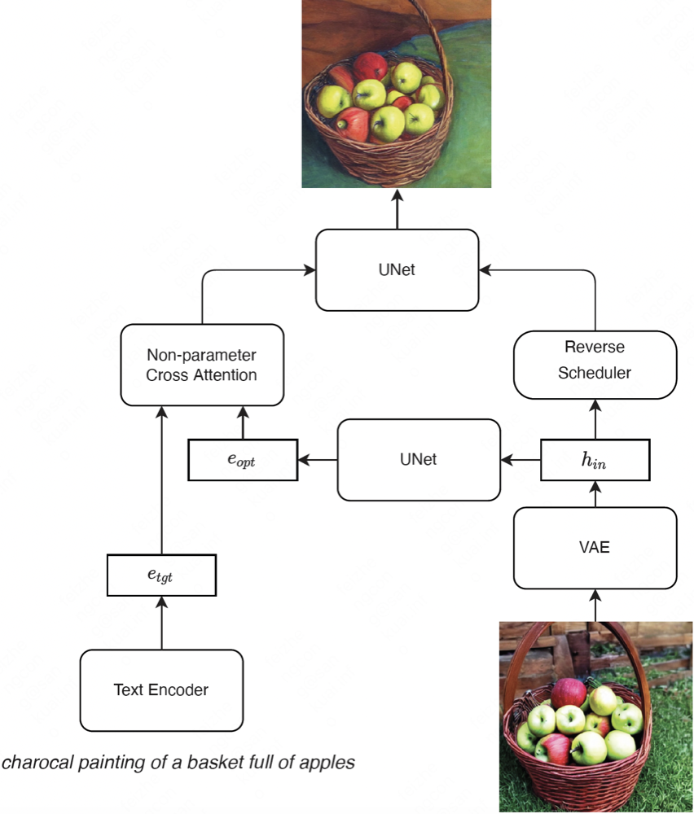
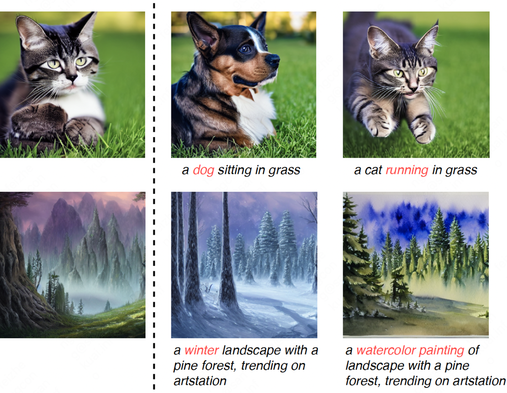

# Stable-Edit 

This is the PyTorch implementation for image editing framework as described in: 

> **Stable-Edit: Text-based real image editing with stable diffusion models**

We address the consistency image editing by inversing both image and text embedding.

## 1. Model Structure 

     
      
     <em>
     Overview of the proposed stable editing framework.
    </em>

## 2. Cases

     
      
     <em>
     Cases for the image editing.
    </em>

This repository is based on [diffusers](https://github.com/huggingface/diffusers).
